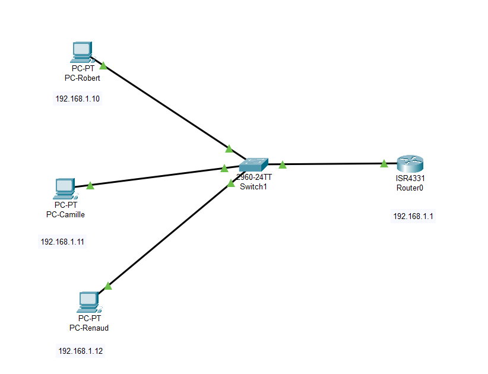
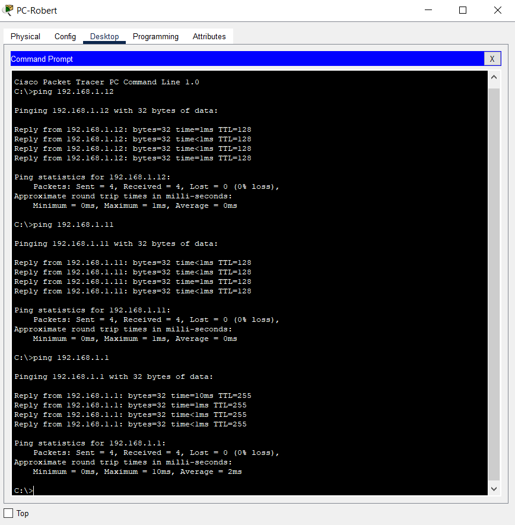

# Building a Simple Network for Hackers Poulette

## What
This project outlines the creation of a basic network infrastructure for Hackers Poulette, a burgeoning startup. The network is designed to be scalable, supporting the startup's ambitious growth plans. The infrastructure includes three hosts connected to a switch, with added internet connectivity through an ISR4331 router.

## Why
The primary goal is to establish a reliable and scalable network that allows the team at Hackers Poulette to communicate internally and access the internet. This setup serves as the foundation for the startup's digital operations, ensuring that the network can grow with the company.

## When
The project was initiated and completed to meet the deadline of 16/03/2024, ensuring that Hackers Poulette's network infrastructure was operational in a timely manner.

## How
Equipment and Software Used
- Cisco Packet Tracer: For designing and simulating the network.
- Switch: Cisco 2960
- Router: Cisco ISR4331 with IP 192.168.1.1
- Hosts: Three Windows 10 PCs
- Cabling: Ethernet cables for connections

### Configuration Steps
Designing the Network: The network was designed using Cisco Packet Tracer, incorporating a Cisco 2960 switch and an ISR4331 router to connect three Windows 10 PCs (PC-Robert, PC-Camille, PC-Renaud).
  
### IP Addressing:
- Router (ISR4331): Configured with the IP address 192.168.1.1 on its LAN interface to act as the gateway for the network.
- PCs: Assigned the following IP addresses and subnet masks:
```
PC-Robert: 192.168.1.10/24
PC-Camille: 192.168.1.11/24
PC-Renaud: 192.168.1.12/24 
```


- Testing Connectivity: 

Utilized the ping utility to verify internal connectivity among the PCs and their ability to reach the internet through the router.

  

 - Simulating Connectivity: 


## Who
This project was a solo challenge completed by Florentina S., aimed at establishing a foundational network for Hackers Poulette under the guidance of Robert Tappan Morris, the CEO and BeCode. 

## Pending Tasks
-  Optimize router configurations for enhanced security.
-  Implement VLANs for network segmentation as the company grows.
-  Set up a firewall for secure internet access.
-  Establish a backup system for network redundancy.
-  Develop a network monitoring system for performance tracking.
-  Integrate wireless access points for mobile devices.
-  Implement a VPN for secure remote access.
-  Establish a disaster recovery plan for network failures.
-  Conduct regular network maintenance and updates.
-  Train employees on network usage and security best practices.
-  Collaborate with external security experts to fortify the network.
-  Scale the network infrastructure to support future growth.
-  Explore cloud-based network solutions for enhanced scalability.
